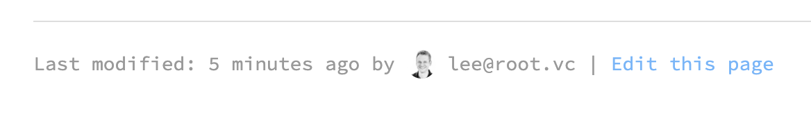
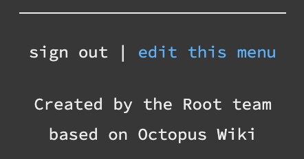

# Root Ventures Founders Wiki

**Founders Wiki** is where Root Ventures portfolio founders can find info such as cloud hosting credits, discounts on products and services like [Brex](https://brex.com) and [Lever](https://lever.co), and recommendations for professional services like executive coaches, product design and industrial design firms, lawyers, accountants, and personal therapists.

This project is based on **🐙 Octopus**, which is a server-less, easy-to-setup internal wiki page with built-in software diagrams support. It uses **Markdown** for writing content and enhances it with [Graphviz](http://graphviz.org) and [flowchart.js](http://flowchart.js.org/) diagrams for easy software documentation.

### Technology

The Root Ventures Founders Wiki is a fork of [Octopus](https://github.com/livechat/octopus), which is a [JAMstack](https://jamstack.org/) app that uses [Google Firebase](https://firebase.google.com/) as its backend. You do not need a web server (such as Apache) or a database (like MySQL) to have it up and running. You can deploy the app to a CDN for free using [Netlify](https://www.netlify.com/).

#### Features
* create new wiki pages with Markdown language,
* edit menu (using Markdown) to easily link to wiki pages,
* include [Graphviz](http://www.graphviz.org/Gallery.php) and [flowchart.js](http://flowchart.js.org/) diagrams inside your Markdown content,

#### Page editing with Markdown
<kbd>
  
</kbd>

## Access
Access to the Founders Wiki is restricted to Root Ventures portfolio founders only. Email any of the partners, or the team to get access.

## Using the Wiki
To create a new page, just enter the URL you wish to create, for example: `https://wiki.root.vc/test/new-page`. If such page has not been created yet, you will see the following screen:

<kbd>
  
</kbd>
  

When you click "Create this page", new page will be created and filled in with default content, ready to edit:

<kbd>
  
</kbd>
  

Once the page is ready, you can easily include it in the menu:

<kbd>
  
</kbd>
  

That's it. Send all your teammates link to wiki and they're ready to contribute!

## Built with
* [Octopus](https://github.com/livechat/octopus)
* React via [create-react-app](https://github.com/facebookincubator/create-react-app).
* [viz.js](https://github.com/mdaines/viz.js/)
* [flowchart.js](https://github.com/adrai/flowchart.js)
* [Firebase](https://firebase.google.com/)

## Original Authors
[Bartosz Olchówka](https://twitter.com/bolchowka/) / CTO @ [LiveChat](https://www.livechatinc.com/)

## License
This project is licensed under the MIT License - see the [LICENSE](./LICENSE) file for details
